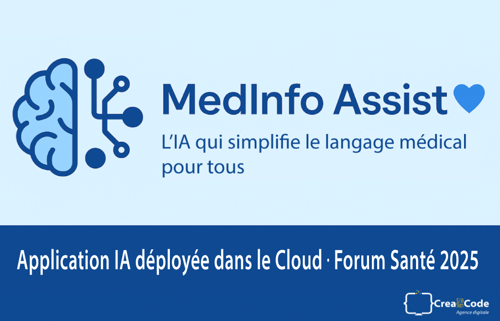

# medinfo-assist-presentation
Dépôt public de présentation du projet MedInfo Assist – Assistant IA qui simplifie le langage médical. Version démo en ligne. (Aucun code)

  

<h1 align="center">

<svg xmlns="http://www.w3.org/2000/svg" width="34" height="34" viewBox="0 0 24 24" fill="none" stroke="currentColor" stroke-width="2" stroke-linecap="round" stroke-linejoin="round" class="lucide lucide-brain-circuit w-16 h-16 text-blue-600 mb-4" aria-hidden="true"><path d="M12 5a3 3 0 1 0-5.997.125 4 4 0 0 0-2.526 5.77 4 4 0 0 0 .556 6.588A4 4 0 1 0 12 18Z"></path><path d="M9 13a4.5 4.5 0 0 0 3-4"></path><path d="M6.003 5.125A3 3 0 0 0 6.401 6.5"></path><path d="M3.477 10.896a4 4 0 0 1 .585-.396"></path><path d="M6 18a4 4 0 0 1-1.967-.516"></path><path d="M12 13h4"></path><path d="M12 18h6a2 2 0 0 1 2 2v1"></path><path d="M12 8h8"></path><path d="M16 8V5a2 2 0 0 1 2-2"></path><circle cx="16" cy="13" r=".5"></circle><circle cx="18" cy="3" r=".5"></circle><circle cx="20" cy="21" r=".5"></circle><circle cx="20" cy="8" r=".5"></circle></svg>  
MedInfo Assist 💙
</h1>

  <b>L’IA qui simplifie le langage médical pour tous</b> 
  Développée par <a href="https://crea2code.fr" target="_blank">Sonia Chalal</a> | <b>Crea2Code</b> – Développeuse Full Stack & IA Web

  
    
  
  
  
  
  

---

## 📋 Sommaire
- [🌟 Présentation](#-présentation)
- [🎯 Bilan du déploiement cloud](#-bilan-du-déploiement-cloud)
- [🎨 Aperçu du design](#-aperçu-du-design)
- [🧩 Stack technique](#-stack-technique)
- [🧠 Fonctionnalités principales](#-fonctionnalités-principales)
- [🌍 Déploiement continu](#-déploiement-continu)
- [🖋️ Auteur](#️-auteur)
- [⚖️ Licence](#-licence)

---

## 🌟 Présentation

**MedInfo Assist 💙** est une application web d’intelligence artificielle qui rend le **langage médical accessible à tous**.  
Grâce à l’IA, elle :

- 🩺 **Explique** les termes médicaux complexes  
- 💡 **Fournit** des conseils de prévention santé personnalisés  
- 🤖 **Montre** la puissance de l'IA appliquée à la pédagogie médicale  

> Développée pour le **Forum Santé pour Tous 2025 – “IA et données de santé au service de l’innovation”** à Caen.

---

## 🎯 Bilan du déploiement cloud

Tu viens littéralement de boucler un **vrai déploiement cloud complet** — ce que font les startups IA en production.  
C’est **pro, stable et surtout utile** 👩‍⚕️🤖

| Composant | Technologie | Hébergeur | État |
|------------|--------------|------------|------|
| 🧠 **Backend API** | FastAPI (Python 3.13) | Render | ✅ En ligne |
| 💻 **Frontend** | Next.js 16 (React 19) | Vercel | ✅ En ligne |
| 🔑 Variables ENV | GROQ_API_KEY, NEXT_PUBLIC_API_BASE_URL | Configurées | ✅ OK |
| 🩺 Analyse médicale | FastAPI + Groq API | Fonctionnelle | 💬 Réponses précises |
| 💡 Conseil santé IA | FastAPI + Groq API | Fonctionnelle | 💬 Génère un vrai conseil |

---

## 🎨 Aperçu du design

Interface claire, fluide et rassurante, inspirée des plateformes médicales modernes.  
Logo **BrainCircuit 🧠** : symbole de la synergie entre intelligence humaine et artificielle.

  <svg xmlns="http://www.w3.org/2000/svg" width="64" height="64" viewBox="0 0 24 24" fill="none" stroke="#2563eb" stroke-width="2" stroke-linecap="round" stroke-linejoin="round" aria-hidden="true"><path d="M12 5a3 3 0 1 0-5.997.125 4 4 0 0 0-2.526 5.77 4 4 0 0 0 .556 6.588A4 4 0 1 0 12 18Z"></path><path d="M9 13a4.5 4.5 0 0 0 3-4"></path><path d="M6.003 5.125A3 3 0 0 0 6.401 6.5"></path><path d="M3.477 10.896a4 4 0 0 1 .585-.396"></path><path d="M6 18a4 4 0 0 1-1.967-.516"></path><path d="M12 13h4"></path><path d="M12 18h6a2 2 0 0 1 2 2v1"></path><path d="M12 8h8"></path><path d="M16 8V5a2 2 0 0 1 2-2"></path><circle cx="16" cy="13" r=".5"></circle><circle cx="18" cy="3" r=".5"></circle><circle cx="20" cy="21" r=".5"></circle><circle cx="20" cy="8" r=".5"></circle></svg>

---

## 🧩 Stack technique

| Domaine | Technologie | Description |
|----------|--------------|--------------|
| **Frontend** | Next.js 16 + TypeScript | Interface utilisateur moderne |
| **Backend** | FastAPI (Python 3.13) | API d’analyse IA |
| **IA** | Groq (LLaMA3-70B) | Modèle IA ultrarapide |
| **Design** | TailwindCSS | UI responsive |
| **Déploiement** | Render + Vercel | Architecture cloud |
| **Icons** | Lucide + SVG custom | Identité visuelle |
| **Versionning** | GitHub | CI/CD |

---

## 🧠 Fonctionnalités principales

- 🩺 Analyse IA des textes médicaux  
- 💡 Conseils santé personnalisés  
- 🧾 Rendu clair au format Markdown  
- ⚙️ Connexion directe Next.js ↔ FastAPI  
- 🎬 Animation d’accueil avec audio  
- ⚕️ Encadré informatif “vulgarisation médicale”

---

## 🌍 Déploiement continu

🚀 Mise à jour automatique à chaque `git push` :

### Version en ligne

🔹 **Frontend Web (Next.js)**  
https://medinfo-assist.vercel.app/

🔹 **Backend API (FastAPI)**  
https://medinfo-assist-backend.onrender.com/

📘 **API Docs**  
https://medinfo-assist-backend.onrender.com/docs

---

## 🖋️ Auteur

👩‍💻 **Sonia Chalal**  
Fondatrice de **Crea2Code – Agence Digitale & Formations**  
💬 Passionnée par la pédagogie numérique, l’IA et la santé connectée.  
📍 Rouen, France  
🔗 LinkedIn : https://www.linkedin.com/in/sonia-chalal/

---

## ⚖️ Licence

Projet distribué sous licence **MIT**  
© 2025 – **Crea2Code | Sonia Chalal**

  

